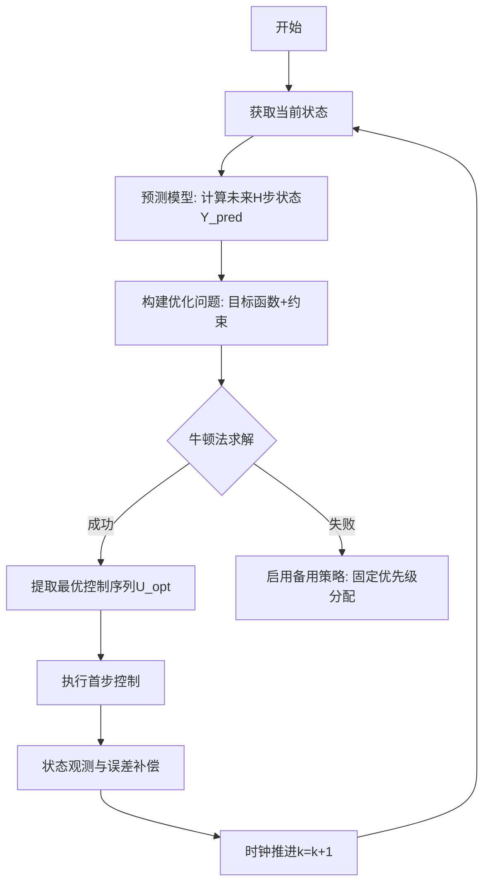

# MPC 调度器开发 ToDoList
> 更新日期: 2025-05-19
> 说明: 项目文件结构已整理，旧版文件已移入legacy目录

**一、MPC 流程框架流程图**



---

**二、数学模型构建**

**1. 状态空间定义**
• 车辆状态向量：

\[
\mathbf{x}_i =
\begin{bmatrix}
p_i \\
v_i \\
a_i \\
r_i \\
\tau_i \\
T_{\text{idle}}^i \\
D^i
\end{bmatrix}, \quad
\begin{aligned}
&p*i: \text{位置 (m)} \\
&v_i: \text{速度 (m/s)} \\
&a_i: \text{加速度 (m/s²)} \\
&r_i: \text{轨道类型 (0:直轨,1:弯轨)} \\
&\tau_i: \text{任务状态编码 (0:空闲,1:移动,2:装卸)} \\
&T*{\text{idle}}^i: \text{累计空闲时间 (s)} \\
&D^i: \text{累计行驶距离 (m)}
\end{aligned}
\]
• 系统状态矩阵：

\[
\mathbf{X} = [\mathbf{x}_1^T, \mathbf{x}_2^T, ..., \mathbf{x}_N^T]^T
\]

**2. 状态空间方程**
离散时间模型（步长 \(\Delta t\)）：
\[
\mathbf{x}_i(k+1) =
\begin{cases}
f_{\text{moving}} =
\begin{bmatrix}
p*i + v_i\Delta t + \frac{1}{2}a_i(\Delta t)^2 \\
\text{clip}(v_i + a_i\Delta t, 0, v*{\text{max}}(r*i)) \\
\text{clip}(a*{\text{cmd}}, -0.5, 0.5) \\
r*i \\
\tau_i \\
T*{\text{idle}}^i + \Delta t \cdot \delta(\tau*i=0) \\
D^i + v_i\Delta t
\end{bmatrix}, & \tau_i \neq 2 \\
f*{\text{loading}} =
\begin{bmatrix}
p*i \\
0 \\
0 \\
0 \\
\tau_i \\
T*{\text{idle}}^i \\
D^i
\end{bmatrix}, & \tau_i = 2
\end{cases}
\]
其中：
• \( \delta(\cdot) \) 为指示函数，条件满足时值为 1，否则为 0

• \( a\_{\text{cmd}} \) 为 MPC 计算的控制输入

**3. 约束条件**
• 动力学约束：

\[
|a_i(k)| \leq 0.5 \, \text{m/s²}
\]
• 速度约束：

\[
v_i(k) \leq
\begin{cases}
2.6667 \, \text{m/s}, & \text{直轨} \\
0.6667 \, \text{m/s}, & \text{弯轨}
\end{cases}
\]
• 防撞约束：

\[
\|p_i(k) - p_j(k)\| \geq 2.2 \, \text{m}, \quad \forall i \neq j
\]
• 任务顺序约束：

\[
t*{\text{start}}^{k+1} \geq t*{\text{end}}^k, \quad \text{同一设备任务}
\]

**4. 目标函数**
多目标加权和：
\[
J = \sum*{h=1}^H \left( \alpha \sum*{i=1}^N T*{\text{idle}}^i(k+h) + \beta \sum*{i=1}^N D^i(k+h) \right)
\]
建议权重：
• \( \alpha = 0.7 \)（时间优化偏好）

• \( \beta = 0.3 \)（能量优化偏好）

---

**三、核心模块设计**

**1. 预测模型模块**
• 输入：当前状态 \( \mathbf{X}(k) \)、控制序列 \( \mathbf{U} \)

• 输出：预测状态序列 \( \mathbf{Y} \)

• 实现方法：

```cpp
class PredictiveModel {
public:
    MatrixXd predict(const VectorXd& x0, const MatrixXd& U) {
        MatrixXd Y(H, x0.size());
        Y.row(0) = x0;
        for (int h=1; h<H; ++h) {
            Y.row(h) = vehicle_dynamics(Y.row(h-1), U.row(h-1));
        }
        return Y;
    }
private:
    VectorXd vehicle_dynamics(const VectorXd& x, const VectorXd& u);
};
```

**2. 优化求解器模块**
• 牛顿法求解器：

```cpp
class NewtonSolver {
public:
    struct Options {
        int max_iterations = 50;
        double tolerance = 1e-6;
        bool use_sparse = true;
    };

    VectorXd solve(const ObjectiveFunction& obj,
                  const Constraints& cons);
};
```

• KKT 条件处理：

• 等式约束：状态转移方程

• 不等式约束：内点法障碍函数

**3. 反馈控制模块**
• 功能：执行控制指令并补偿预测误差

• 关键逻辑：

```cpp
void FeedbackController::apply_control(const VectorXd& u_opt) {
    // 1. 发送加速度指令给车辆
    send_acceleration_command(u_opt);

    // 2. 监测实际状态与预测差异
    VectorXd x_real = get_sensor_data();
    VectorXd error = x_real - Y_pred_.row(0);

    // 3. 误差补偿（比例校正）
    Y_pred_.block(0, 0, H-1, Y_pred_.cols()) = Y_pred_.block(1, 0, H-1, Y_pred_.cols());
    Y_pred_.row(H-1) = predictive_model_.predict(Y_pred_.row(H-2), U_opt_.row(H-2));
    Y_pred_ += K_gain_ * error.replicate(H, 1);
}
```

---

**四、C++项目目录结构**

```bash
mpc_scheduler/
├── CMakeLists.txt            # 项目构建文件
├── include/
│   ├── model/
│   │   ├── PredictiveModel.hpp   # 预测模型类
│   │   └── VehicleState.hpp      # 状态定义
│   ├── solver/
│   │   ├── NewtonSolver.hpp      # 牛顿法求解器
│   │   └── Constraints.hpp       # 约束处理
│   └── controller/
│       ├── MPCController.hpp     # MPC主控制器
│       └── FeedbackController.hpp# 反馈校正
├── src/
│   ├── model/
│   │   ├── PredictiveModel.cpp   # 模型实现
│   │   └── VehicleState.cpp
│   ├── solver/
│   │   ├── NewtonSolver.cpp      # 求解器实现
│   │   └── Constraints.cpp
│   └── controller/
│       ├── MPCController.cpp
│       └── FeedbackController.cpp
├── test/
│   ├── test_predictive_model.cpp # 单元测试
│   └── test_newton_solver.cpp
├── examples/
│   └── demo_scheduler.cpp        # 使用示例
└── third_party/
    ├── eigen/                    # Eigen库
    └── spdlog/                   # 日志库
```

---

**五、开发里程碑计划**

| 阶段 | 任务           | 交付物                         | 时间 |
| ---- | -------------- | ------------------------------ | ---- |
| 1    | 基础框架搭建   | CMake 项目结构、核心类接口定义 | 3 天 |
| 2    | 预测模型实现   | PredictiveModel 类通过单元测试 | 2 天 |
| 3    | 牛顿法求解器   | NewtonSolver 支持带约束优化    | 5 天 |
| 4    | MPC 控制器集成 | MPC 闭环仿真示例运行           | 3 天 |
| 5    | 性能优化       | 稀疏矩阵处理、热启动实现       | 4 天 |
| 6    | 系统验证       | 测试报告（约束满足率、实时性） | 3 天 |

---

**六、关键技术栈**
• 线性代数：Eigen 库（矩阵运算）

• 稀疏求解：SuiteSparse（Cholmod 分解）

• 日志系统：spdlog

• 可视化：Matplotlib-cpp（结果绘图）

• 实时性保障：C++17 异步任务
