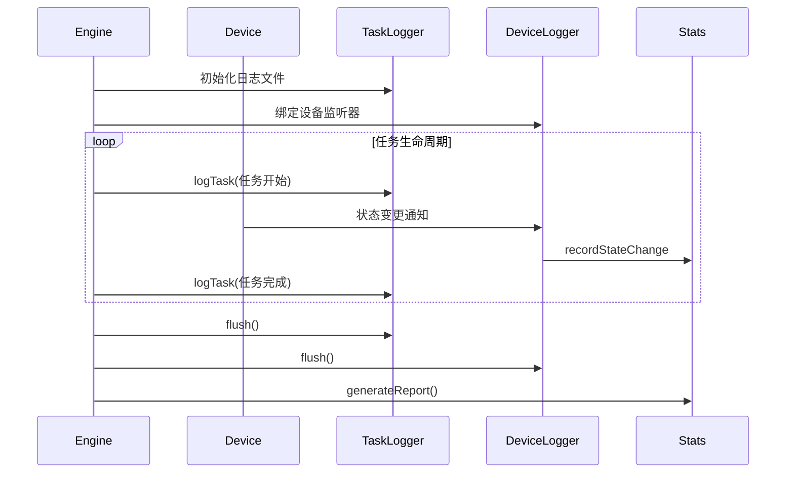

## Data模块类设计详解

### 1. ConfigLoader 配置加载器（Data/ConfigLoader.hpp）
```cpp
class ConfigLoader {
public:
    /**
     * @brief 加载并解析JSON配置文件
     * @param path 配置文件路径
     * @return 包含轨道参数、车辆参数的结构体
     * @throws std::runtime_error 文件解析失败时抛出
     */
    SimulationConfig loadConfig(const std::string& path) const;

private:
    // JSON字段映射
    const std::map<std::string, DeviceType> DEVICE_TYPE_MAP = {
        {"StorageIn", DeviceType::StorageIn},
        {"StorageOut", DeviceType::StorageOut}
    };

    /**
     * @brief 解析设备布局数据
     * @param j JSON节点
     */
    void parseDevices(const nlohmann::json& j, SimulationConfig& config) const;
};
```

### 2. TaskLogger 任务日志记录器（Data/TaskLogger.hpp）
```cpp
class TaskLogger {
public:
    struct TaskRecord {
        int taskId;
        std::string materialId;
        TaskType type;
        int startDevice;
        int endDevice;
        double startTime;
        int vehicleId;
        double pickupTime;
        double deliveryTime;
        double vanishTime;
    };

    /**
     * @brief 初始化日志文件（清空已有内容）
     */
    void initialize();

    /**
     * @brief 添加任务记录（线程安全）
     * @param record 任务数据包
     */
    void logTask(const TaskRecord& record);

    /**
     * @brief 强制刷新缓冲区到磁盘
     */
    void flush();

private:
    std::mutex m_mutex;
    std::ofstream m_file;
    std::queue<TaskRecord> m_buffer;
    static constexpr size_t BUFFER_FLUSH_SIZE = 100;
};
```

### 3. DeviceLogger 设备日志记录器（Data/DeviceLogger.hpp）
```cpp
class DeviceLogger {
public:
    struct StateChange {
        double timestamp;
        int deviceId;
        std::string materialId;
        DeviceStatus oldStatus;
        DeviceStatus newStatus;
    };

    /**
     * @brief 监听设备状态变更事件
     * @param device 目标设备引用
     */
    void attach(DeviceBase& device);

    /**
     * @brief 生成标准化日志条目
     * @param change 状态变更事件 
     */
    std::string formatLogEntry(const StateChange& change) const;

    // 文件操作方法与TaskLogger类似
};
```
# # <!-- 我不需要 -->
### 4. StatisticsAggregator 统计聚合器（Data/StatisticsAggregator.hpp）
```cpp
class StatisticsAggregator {
public:
    struct DeviceStats {
        double totalIdleTime = 0.0;
        double totalBusyTime = 0.0;
        int taskCount = 0;
    };

    /**
     * @brief 记录设备状态变更时间点
     * @param deviceId 设备ID
     * @param newStatus 新状态
     * @param timestamp 事件时间戳 
     */
    void recordStateChange(int deviceId, DeviceStatus newStatus, double timestamp);

    /**
     * @brief 生成最终统计报告
     * @param totalSimTime 总仿真时间
     */
    std::map<int, DeviceStats> generateReport(double totalSimTime) const;

private:
    struct DeviceHistory {
        DeviceStatus currentStatus;
        double lastChangeTime;
        std::vector<std::pair<double, DeviceStatus>> timeline;
    };

    std::map<int, DeviceHistory> m_deviceHistories;
};
```
# # <!-- 提前定义 -->
### 数据结构定义（Data/DataTypes.hpp）
```cpp
// 配置数据结构
struct SimulationConfig {
    struct {
        float straightLength;    // 直轨长度（米）
        float curveRadius;       // 弯道半径（米）
        float totalCircumference;// 轨道总周长
    } trackParams;

    struct VehicleParams {
        float maxStraightSpeed;  // 直轨最大速度（m/s）
        float maxCurveSpeed;     // 弯轨最大速度（m/s）
        float acceleration;      // 加速度（m/s²）
    };

    std::vector<std::pair<int, DeviceType>> deviceLayout; // 设备ID与类型对应表
};
```

### 数据流交互机制


## 关键实现细节

# # <!-- 我不需要 -->
### 1. 异步日志写入  
```cpp
// TaskLogger的日志线程函数
void TaskLogger::loggingThread() {
    while (m_running) {
        std::queue<TaskRecord> bufferCopy;
        {
            std::lock_guard<std::mutex> lock(m_mutex);
            bufferCopy.swap(m_buffer);
        }

        while (!bufferCopy.empty()) {
            auto& record = bufferCopy.front();
            m_file << record.taskId << "\t"
                   << record.materialId << "\t"
                   << static_cast<int>(record.type) << "\n";
            bufferCopy.pop();
        }
        
        std::this_thread::sleep_for(100ms);
    }
}
```

# # <!-- 我不需要，读取他们的数据就行 -->
### 2. 设备状态跟踪  
```cpp
void StatisticsAggregator::recordStateChange(int deviceId, 
                                            DeviceStatus newStatus,
                                            double timestamp) {
    auto& history = m_deviceHistories[deviceId];
    
    if (history.timeline.empty()) {
        history.timeline.emplace_back(0.0, DeviceStatus::Idle);
    }
    
    // 计算持续时间
    double duration = timestamp - history.lastChangeTime;
    switch (history.currentStatus) {
        case DeviceStatus::Idle: 
            history.totalIdleTime += duration;
            break;
        case DeviceStatus::Busy:
            history.totalBusyTime += duration;
            break;
    }
    
    // 更新当前状态
    history.currentStatus = newStatus;
    history.lastChangeTime = timestamp;
    history.timeline.emplace_back(timestamp, newStatus);
}
```

### 3. 配置加载范例  
```json
// config.json
{
    "track": {
        "straight_length": 25.6,
        "curve_radius": 8.2
    },
    "vehicles": {
        "max_straight_speed": 2.6667, // 160m/min → 2.6667m/s
        "max_curve_speed": 0.6667,    // 40m/min → 0.6667m/s
        "acceleration": 0.5
    },
    "devices": [
        {"id":1, "type":"StorageIn"},
        {"id":13, "type":"WorkstationOut"}
    ]
}
```

### 4. 日志文件格式示例  
```text
// TaskExeLog.txt
T001	MAT2023-001	0	16	5	0.000	V1	7.500	15.000	25.000
T002	MAT2023-002	1	2	13	1.200	V3	8.700	16.200	46.200

// DeviceStateLog.txt
0.000	16	MAT2023-001	0→1
7.500	5	MAT2023-001	0→1
15.000	5	MAT2023-001	1→0
```

## 集成注意事项

### 1. 时间同步机制  
```cpp
// 使用仿真引擎的统一时钟
double timestamp = SimulationClock::getInstance().getTime();
```

### 2. 异常处理  
```cpp
try {
    m_file.open("TaskExeLog.txt");
} catch (const std::ofstream::failure& e) {
    throw std::runtime_error("无法创建日志文件: " + std::string(e.what()));
}
```

### 3. 性能优化  
- 使用内存缓冲减少磁盘操作

- 采用二进制临时文件格式提升写入速度

- 对高频更新的统计数据进行采样记录


### 4. 跨平台适配  
```cpp
// 处理文件路径差异
#ifdef _WIN32
    constexpr char PATH_SEPARATOR = '\\';
#else
    constexpr char PATH_SEPARATOR = '/';
#endif
```
