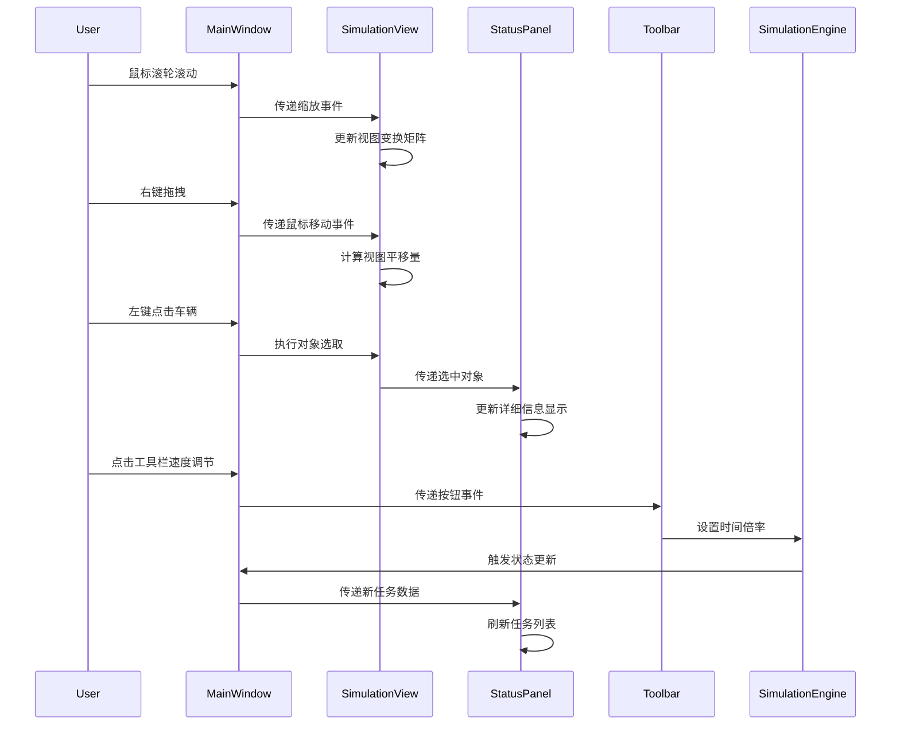

## GUI模块类设计框架

### 1. MainWindow 主窗口管理（GUI/MainWindow.hpp）
```cpp
class MainWindow : public sf::RenderWindow {
private:
    // 窗口布局参数
    const sf::Vector2u m_initialSize {1280, 720};  // 初始分辨率
    const float m_toolbarHeight = 30.0f;           // 工具栏高度
    
    // 子视图组件
    std::unique_ptr<SimulationView> m_simView;      // 仿真视图区域
    std::unique_ptr<StatusPanel> m_statusPanel;     // 右侧状态面板
    std::unique_ptr<Toolbar> m_toolbar;             // 顶部工具栏
    
    // 样式资源
    sf::Font m_globalFont;                         // 全局字体
    sf::Color m_backgroundColor {45, 50, 55};       // 背景色

public:
    /**
     * @brief 初始化窗口布局
     * @param engine 仿真引擎引用（用于数据绑定）
     */
    void initialize(SimulationEngine& engine);

    /**
     * @brief 处理窗口事件循环
     */
    void runEventLoop();

private:
    /**
     * @brief 处理SFML原生事件
     * @param event SFML事件对象
     */
    void handleSystemEvent(const sf::Event& event);
};
```

### 2. SimulationView 仿真视图（GUI/SimulationView.hpp）
```cpp
class SimulationView {
private:
    // 视图变换参数
    sf::View m_worldView;              // 世界坐标系视图
    sf::View m_uiView;                 // UI叠加层视图
    sf::Vector2f m_viewCenter;         // 当前视图中心（世界坐标）
    float m_zoomLevel = 1.0f;          // 当前缩放级别
    
    // 对象渲染器
    TrackRenderer m_trackRenderer;     // 轨道绘制组件
    DeviceRenderer m_deviceRenderer;   // 设备绘制组件
    VehicleRenderer m_vehicleRenderer; // 车辆绘制组件
    
    // 交互状态
    bool m_isDragging = false;         // 正在拖拽视图标志
    sf::Vector2f m_lastMousePos;       // 上一次鼠标位置（屏幕坐标）

public:
    /**
     * @brief 更新视图变换参数
     * @param deltaTime 帧时间
     */
    void updateViewTransforms(float deltaTime);

    /**
     * @brief 渲染世界场景
     * @param target SFML渲染目标
     */
    void renderWorld(sf::RenderTarget& target);

    /**
     * @brief 处理视图相关输入事件
     * @param event SFML事件对象
     * @param mousePos 鼠标当前位置（屏幕坐标）
     */
    void handleViewEvent(const sf::Event& event, const sf::Vector2f& mousePos);
};
```

### 3. TrackRenderer 轨道渲染器（GUI/TrackRenderer.hpp）
```cpp
class TrackRenderer : public sf::Drawable {
private:
    // 轨道几何数据
    sf::VertexArray m_straightSegments; // 直轨顶点数组
    sf::VertexArray m_curveSegments;    // 弯轨顶点数组
    
    // 样式参数
    const float m_trackWidth = 4.0f;    // 轨道线宽
    sf::Color m_straightColor {180, 180, 180}; // 直轨颜色
    sf::Color m_curveColor {160, 160, 160};   // 弯轨颜色

public:
    /**
     * @brief 根据物理参数生成轨道几何形状
     * @param trackLength 轨道总长
     * @param curveRadius 弯道半径
     */
    void generateGeometry(float trackLength, float curveRadius);

protected:
    void draw(sf::RenderTarget& target, sf::RenderStates states) const override;
};
```

### 4. DeviceRenderer 设备渲染器（GUI/DeviceRenderer.hpp）
```cpp
class DeviceRenderer {
private:
    // 设备类型图标映射
    std::map<DeviceType, sf::Texture> m_iconTextures;
    
    // 状态颜色编码
    const sf::Color COLOR_IDLE {75, 185, 85};    // 空闲状态
    const sf::Color COLOR_BUSY {215, 60, 60};    // 忙碌状态
    const sf::Color COLOR_PENDING {230, 170, 50};// 准备中状态

public:
    /**
     * @brief 绘制单个设备
     * @param target 渲染目标
     * @param device 设备数据引用
     * @param position 设备世界坐标
     */
    void renderDevice(sf::RenderTarget& target, 
                     const DeviceState& device,
                     const sf::Vector2f& position);

    /**
     * @brief 加载设备图标资源
     * @param basePath 图标文件基础路径
     */
    void loadResources(const std::string& basePath);
};
```

### 5. VehicleRenderer 车辆渲染器（GUI/VehicleRenderer.hpp）
```cpp
class VehicleRenderer {
private:
    // 车辆模型参数
    const sf::Vector2f m_baseSize {16.0f, 8.0f}; // 基础尺寸（像素）
    
    // 状态样式
    sf::Color m_colorEmpty {80, 130, 200};       // 空载状态
    sf::Color m_colorLoaded {200, 90, 40};       // 载货状态
    sf::Color m_colorAssigned {140, 80, 160};     // 已分配任务状态

public:
    /**
     * @brief 绘制单个车辆
     * @param target 渲染目标
     * @param vehicle 车辆数据引用
     * @param position 车辆世界坐标
     * @param rotation 车辆朝向角度
     */
    void renderVehicle(sf::RenderTarget& target,
                      const VehicleState& vehicle,
                      const sf::Vector2f& position,
                      float rotation);
};
```

### 6. StatusPanel 状态面板（GUI/StatusPanel.hpp）
```cpp
class StatusPanel {
private:
    // 布局参数
    const float m_panelWidth = 300.0f;         // 面板宽度
    const sf::Color m_backgroundColor {35, 40, 45}; // 背景色
    
    // 内容元素
    std::unique_ptr<TaskListView> m_taskList;  // 任务队列视图
    std::unique_ptr<ObjectInspector> m_inspector; // 对象详细信息
    
public:
    /**
     * @brief 更新面板显示内容
     * @param selectedObject 当前选中的对象（可为nullptr）
     * @param pendingTasks 全局待处理任务队列
     */
    void refreshContent(const SimObject* selectedObject,
                       const std::vector<Task>& pendingTasks);

    /**
     * @brief 渲染面板界面
     * @param target 渲染目标
     * @param position 面板左上角位置
     */
    void render(sf::RenderTarget& target, const sf::Vector2f& position);
};
```

### 7. Toolbar 工具栏（GUI/Toolbar.hpp）
```cpp
class Toolbar {
private:
    // 控件集合
    std::vector<std::unique_ptr<Button>> m_buttons; // 功能按钮
    std::unique_ptr<TimeDisplay> m_timeDisplay;    // 时间显示组件
    std::unique_ptr<SpeedControl> m_speedControl;  // 速度调节滑块

public:
    /**
     * @brief 处理工具栏区域输入事件
     * @param event SFML事件对象
     * @param mousePos 鼠标位置（相对窗口坐标）
     * @return 是否消耗了该事件
     */
    bool handleEvent(const sf::Event& event, const sf::Vector2f& mousePos);

    /**
     * @brief 更新时间显示数值
     * @param simTime 当前仿真时间
     * @param realTime 程序运行时间
     */
    void updateTimeDisplay(float simTime, float realTime);
};
```

## GUI模块交互流程


## 关键设计特性

### 1. 视图分层架构
- 采用`sf::View`实现世界坐标与UI坐标分离

- 世界视图支持平移/缩放，UI视图保持屏幕固定位置

- 使用`sf::RenderTexture`实现离屏渲染优化


### 2. 对象选取机制
```cpp
// 基于像素查询的对象选取
const sf::Vector2f worldPos = m_simView->mapPixelToCoords(mousePos);
const sf::Uint8* pixelData = m_framebuffer.getPixelsPtr();
// 通过预渲染的ID缓冲区进行精确选取
```

### 3. 动态样式管理
```cpp
// 设备状态颜色映射示例
switch(device.status) {
case DeviceStatus::Idle:
    shape.setFillColor(COLOR_IDLE);
    break;
case DeviceStatus::Processing:
    shape.setFillColor(COLOR_BUSY);
    break;
case DeviceStatus::Pending:
    shape.setFillColor(COLOR_PENDING);
    break;
}
```

### 4. 性能优化策略
- 静态元素批处理（如轨道顶点数组）

- 动态元素实例化渲染（车辆/设备）

- 异步纹理加载（`sf::Thread` + 加载队列）


### 5. 输入事件路由
```cpp
// 主窗口事件分发逻辑
void MainWindow::handleSystemEvent(const sf::Event& event) {
    if (m_toolbar->handleEvent(event, mousePos)) return;
    if (m_simView->handleEvent(event, mousePos)) return;
    // ...其他事件处理
}
```
