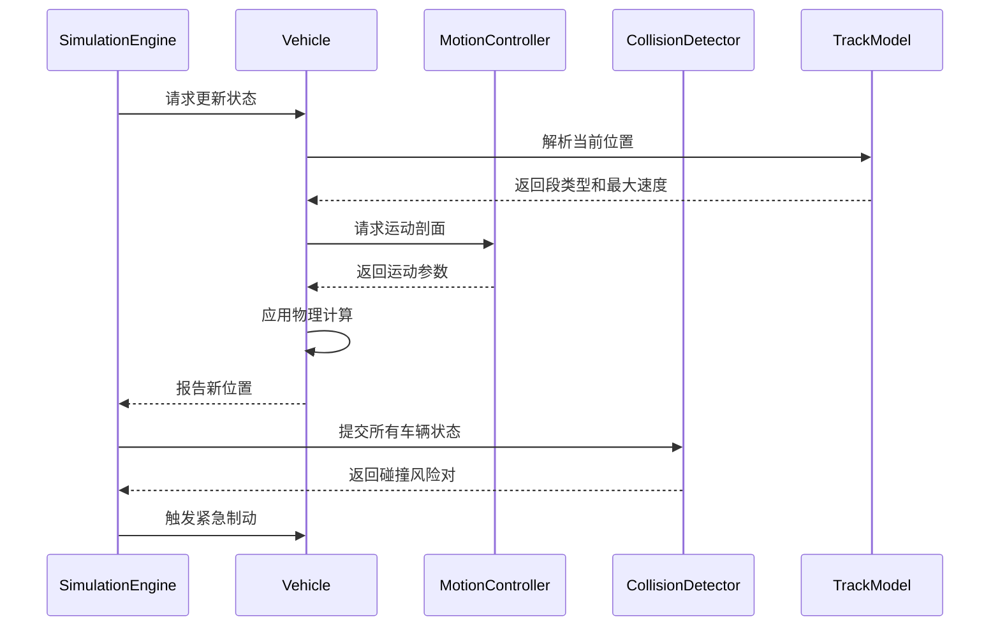

## Physics模块类设计

### 1. MotionController 运动控制器（Physics/MotionController.hpp）
```cpp
class MotionController {
public:
    // 运动阶段标识
    enum class PhaseType {
        Acceleration,
        Cruise,
        Deceleration,
        FullStop
    };

    // 运动剖面描述结构体
    struct MotionProfile {
        std::vector<PhaseType> phaseSequence; // 阶段序列
        std::vector<float> phaseDurations;    // 各阶段持续时间（秒）
        float totalDistance;                  // 总移动距离（米）
    };

    /**
     * @brief 生成点到点的运动控制曲线
     * @param currentSpeed 当前速度（米/秒）
     * @param targetSpeed 目标速度（米/秒）
     * @param maxSpeed 轨道段允许的最大速度（米/秒）
     * @param acceleration 加减速度绝对值（米/秒²）
     * @param distance 需要覆盖的轨道距离（米）
     * @return 运动剖面计算结果
     */
    static MotionProfile calculateProfile(
        float currentSpeed,
        float targetSpeed,
        float maxSpeed,
        float acceleration, 
        float distance
    );

    /**
     * @brief 实时更新车辆运动状态
     * @param currentPos 当前位置（米）
     * @param currentSpeed 当前速度（米/秒）
     * @param profile 运动剖面引用
     * @param deltaTime 时间步长（秒）
     * @return 新位置和速度
     */
    static std::pair<float, float> applyMovement(
        float currentPos,
        float currentSpeed,
        const MotionProfile& profile,
        float deltaTime
    );
};
```

### 2. CollisionDetector 碰撞检测器（Physics/CollisionDetector.hpp）
```cpp
class CollisionDetector {
private:
    struct VehicleProxy {
        float position;      // 轨道上的位置（米）
        float length;        // 车辆长度（米）
        float currentSpeed;  // 当前速度（米/秒）
    };

public:
    /**
     * @brief 预测性碰撞检测
     * @param vehicles 车辆状态快照
     * @param safetyMargin 安全间距（米）
     * @param lookaheadTime 预测时间窗口（秒）
     * @return 存在碰撞风险的车辆对列表
     */
    static std::vector<std::pair<int, int>> checkCollisions(
        const std::vector<VehicleProxy>& vehicles,
        float safetyMargin,
        float lookaheadTime = 3.0f
    );

    /**
     * @brief 实时紧急制动计算
     * @param leading 前车状态
     * @param trailing 后车状态 
     * @param deceleration 制动加速度（米/秒²）
     * @return 建议的后车减速度（0-1表示紧急程度）
     */
    static float calculateEmergencyBrake(
        const VehicleProxy& leading,
        const VehicleProxy& trailing,
        float deceleration
    );
};
```

### 3. TrackModel 轨道物理模型（Physics/TrackModel.hpp）
```cpp
class TrackModel {
private:
    struct Segment {
        enum class Type { Straight, Curve } type;
        float startPos;    // 起始位置（米）
        float length;      // 段长度（米）
        float maxSpeed;    // 段允许最大速度（米/秒）
    };

    std::vector<Segment> segments;  // 轨道段序列
    float totalLength;              // 轨道总长（米）

public:
    /**
     * @brief 根据布局参数构建轨道模型
     * @param straightLength 单侧直轨长度（米）
     * @param curveRadius 弯道半径（米）
     */
    void buildFromParameters(float straightLength, float curveRadius);

    /**
     * @brief 获取指定位置所在的轨道段
     * @param position 轨道位置（米）
     * @return 段类型和局部位置
     */
    std::pair<Segment::Type, float> resolvePosition(float position) const;

    /**
     * @brief 计算轨道坐标系到世界坐标的变换
     * @param trackPos 轨道位置（米）
     * @return 世界坐标系中的(x,y)和旋转角度（弧度）
     */
    sf::Vector2f toWorldPosition(float trackPos, float& outRotation) const;
};
```

### 物理模块交互流程


## 关键算法实现

### 1. 梯形速度曲线计算
```cpp
MotionProfile MotionController::calculateProfile(...) {
    // 计算加速到目标速度所需距离
    float accelDistance = (pow(targetSpeed,2) - pow(currentSpeed,2)) / (2*acceleration);
    
    // 判断是否需要匀速阶段
    if (accelDistance > distance) {
        // 三角波速度曲线
        float t_accel = (sqrt(2*acceleration*distance + pow(currentSpeed,2)) - currentSpeed)/acceleration;
        return { {PhaseType::Acceleration, PhaseType::Deceleration}, 
                {t_accel, t_accel}, distance };
    } else {
        // 梯形速度曲线
        float t_cruise = (distance - accelDistance*2) / targetSpeed;
        return { {PhaseType::Acceleration, PhaseType::Cruise, PhaseType::Deceleration},
                {t_accel, t_cruise, t_accel}, distance };
    }
}
```

### 2. 碰撞预测算法
```cpp
vector<pair<int, int>> CollisionDetector::checkCollisions(...) {
    vector<VehicleProxy> orderedVehicles = sortVehicles(vehicles);
    vector<pair<int, int>> collisions;

    for (size_t i = 1; i < orderedVehicles.size(); ++i) {
        const auto& front = orderedVehicles[i-1];
        const auto& rear = orderedVehicles[i];
        
        // 计算相对运动
        float closingSpeed = rear.currentSpeed - front.currentSpeed;
        float currentGap = (front.position - rear.position) 
                         - rear.length - safetyMargin;

        if (closingSpeed > 0 && currentGap / closingSpeed < lookaheadTime) {
            collisions.emplace_back(rear.id, front.id);
        }
    }
    return collisions;
}
```

### 3. 轨道坐标转换
```cpp
sf::Vector2f TrackModel::toWorldPosition(float trackPos, float& outRotation) const {
    trackPos = fmod(trackPos, totalLength); // 处理环形轨道
    auto [type, localPos] = resolvePosition(trackPos);

    if (type == Segment::Type::Straight) {
        outRotation = 0.0f;
        return sf::Vector2f(localPos, 0);
    } else {
        // 弯道圆弧坐标计算
        float theta = localPos / curveRadius; // 弧度角
        outRotation = theta;
        return sf::Vector2f(
            straightLength + curveRadius * sin(theta),
            curveRadius * (1 - cos(theta))
        );
    }
}
```

## 集成注意事项

### 1. 单位统一规范
```cpp
// 将题目中的毫米参数转换为米
const float VEHICLE_LENGTH = 2.0f;          // 2000 mm → 2 m
const float MIN_DISTANCE = 0.2f;            // 200 mm → 0.2 m
```

### 2. 时间步长处理
```cpp
// 使用固定时间步保证物理稳定性
const float FIXED_TIMESTEP = 0.016f; // ≈60 FPS
while (accumulator >= FIXED_TIMESTEP) {
    updatePhysics(FIXED_TIMESTEP);
    accumulator -= FIXED_TIMESTEP;
}
```

### 3. 车辆状态同步
```cpp
// 在Vehicle类中整合物理控制器
void Vehicle::update(float deltaTime) {
    if (currentTask) {
        auto profile = MotionController::calculateProfile(...);
        tie(newPos, newSpeed) = MotionController::applyMovement(...);
        
        // 更新轨道位置
        trackPosition = fmod(newPos, trackModel.totalLength);
    }
}
```

### 4. 紧急制动处理
```cpp
// 在检测到碰撞风险时调整运动剖面
if (collisionRisk) {
    currentProfile = MotionController::calculateProfile(
        currentSpeed, 0.0f, maxSpeed, acceleration, remainingDistance
    );
}
```
