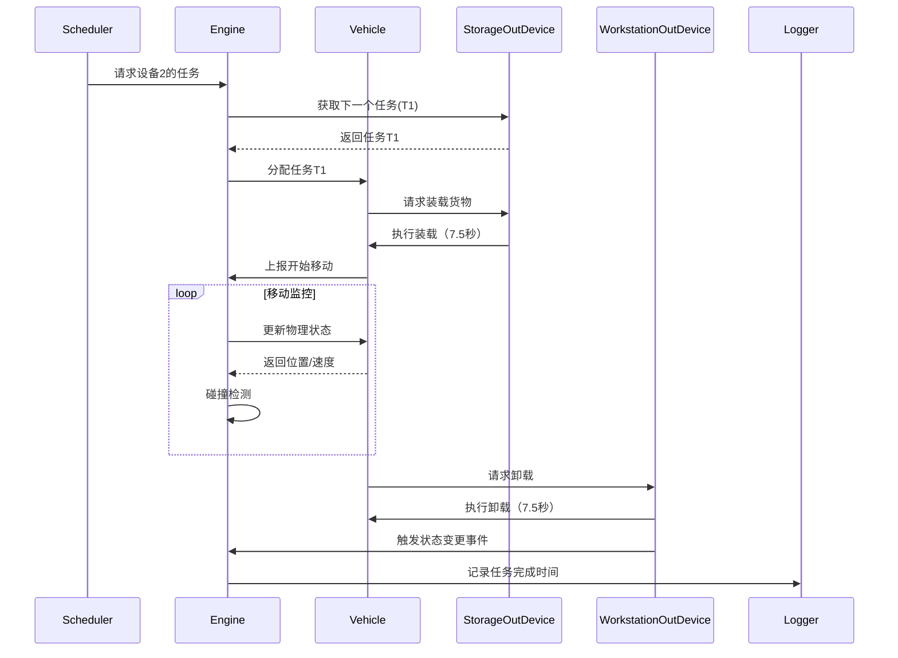

## Core模块类设计

### 1. SimulationEngine 类（Core/SimulationEngine.hpp）
```cpp
class SimulationEngine {
private:
    // 仿真核心组件
    sf::Clock m_realClock;            // 真实时间计时器
    float m_simTime = 0.0f;           // 累积仿真时间（秒）
    float m_timeScale = 1.0f;         // 时间缩放系数
    
    // 对象容器
    std::vector<Vehicle> m_vehicles;  // 车辆集合（按轨道顺序存储）
    std::map<int, DeviceBase*> m_devices; // 设备映射表（键值为设备ID）
    
    // 任务系统
    TaskQueue m_pendingTasks;        // 全局待处理任务
    std::unordered_map<int, std::queue<Task>> m_deviceTaskQueues; // 设备专属任务队列

    // 物理参数
    float m_trackLength;              // 轨道总长度（米）
    float m_safetyDistance;           // 安全距离（转换为米）

public:
    // 生命周期管理
    /**
     * @brief 初始化仿真环境
     * @param config 配置数据引用
     * @param initialTasks 初始任务列表
     * @throws std::runtime_error 当设备初始化失败时抛出
     */
    void initialize(const ConfigData& config, const std::vector<Task>& initialTasks);
    
    /**
     * @brief 执行单步仿真计算
     * @param realDelta 真实时间增量（秒）
     * @return 本步消耗的仿真时间（秒）
     */
    float step(float realDelta);
    
    // 任务管理
    /**
     * @brief 添加任务到指定设备队列
     * @param task 新任务对象
     * @param deviceId 目标设备ID
     * @return 是否成功添加（设备存在且符合任务类型）
     */
    bool addTask(const Task& task, int deviceId);
    
    /**
     * @brief 获取指定设备的首个待处理任务
     * @param deviceId 设备ID
     * @return 任务指针（nullptr表示无任务）
     */
    const Task* peekDeviceTask(int deviceId) const;
    
    // 状态查询
    /**
     * @brief 获取指定车辆的详细状态
     * @param vehicleId 车辆索引（非ID）
     * @return 包含位置、速度等信息的结构体
     */
    VehicleState getVehicleStatus(size_t vehicleId) const;
    
    /**
     * @brief 获取设备当前状态
     * @param deviceId 设备ID
     * @return 设备状态枚举（空闲、准备中、忙碌）
     */
    DeviceStatus getDeviceStatus(int deviceId) const;
};
```

### 2. Vehicle 类（Core/Vehicle.hpp）
```cpp
class Vehicle {
public:
    // 运动状态枚举
    enum class MotionState {
        Accelerating,  // 加速阶段
        Cruising,      // 匀速阶段
        Decelerating,  // 减速阶段
        Stopped        // 静止状态
    };

private:
    // 固有属性
    const float m_length;            // 车辆长度（米）
    const float m_maxStraightSpeed;   // 直轨最大速度（米/秒）
    const float m_maxCurveSpeed;     // 弯轨最大速度（米/秒）
    const float m_acceleration;       // 加减速度（米/秒²）
    
    // 动态状态
    struct {
        float position;               // 轨道位置（0~trackLength）
        float currentSpeed;           // 当前速度（米/秒）
        MotionState motionState;      // 当前运动状态
        const Task* currentTask = nullptr; // 当前执行的任务
        sf::Clock operationTimer;     // 装卸货操作计时器
    } m_state;

public:
    // 运动控制
    /**
     * @brief 更新车辆物理状态
     * @param deltaTime 仿真时间增量（秒）
     * @param leadingVehicle 前车对象（可为nullptr）
     * @param trackInfo 当前轨道段信息（直轨/弯轨）
     * @return 是否发生状态变更（用于触发UI更新）
     */
    bool updatePhysics(float deltaTime, const Vehicle* leadingVehicle, const TrackSegment& trackInfo);
    
    // 任务操作
    /**
     * @brief 开始执行任务
     * @param task 任务对象引用
     * @param currentDevice 当前所在设备引用
     * @return 是否成功启动任务
     */
    bool startTask(const Task& task, DeviceBase& currentDevice);
    
    /**
     * @brief 完成当前任务
     * @param targetDevice 目标设备引用
     */
    void completeTask(DeviceBase& targetDevice);
    
    // 状态查询
    /**
     * @brief 获取车辆当前位置（轨道坐标系）
     * @return 标准化位置（0.0~1.0对应轨道周长）
     */
    float getNormalizedPosition() const;
    
    /**
     * @brief 获取当前载货状态
     * @return 货物信息结构体（包含物料编号等）
     */
    CargoInfo getCargoInfo() const;
};
```

### 3. 设备基类体系（Core/Device.hpp）
```cpp
// 设备类型枚举
enum class DeviceType {
    StorageIn,      // 入库接口设备（1,3,5,7,9,11）
    StorageOut,     // 出库接口设备（2,4,6,8,10,12）
    WorkstationIn,  // 入库作业口（16,17,18）
    WorkstationOut  // 出库作业口（13,14,15）
};

// 设备基类
class DeviceBase {
protected:
    const int m_id;                   // 设备唯一标识
    DeviceStatus m_status;            // 当前状态
    std::queue<Task> m_taskQueue;     // 任务等待队列
    sf::Clock m_processingTimer;      // 处理计时器（用于堆垛机/人工操作）
    
public:
    DeviceBase(int id, DeviceType type);
    
    /**
     * @brief 更新设备状态
     * @param deltaTime 仿真时间增量（秒）
     * @return 是否有状态变更（如完成货物处理）
     */
    virtual bool update(float deltaTime) = 0;
    
    /**
     * @brief 添加新任务到队列
     * @param task 任务对象
     */
    void enqueueTask(const Task& task);
    
    // 其他公共接口...
};

// 入库接口设备特化
class StorageInDevice : public DeviceBase {
private:
    bool m_readyForUnload;           // 是否允许卸货
public:
    StorageInDevice(int id);
    
    bool update(float deltaTime) override;
    
    /**
     * @brief 通知堆垛机完成取货
     * @param success 是否成功取货
     */
    void notifyCargoPickup(bool success);
};

// 出库作业口特化
class WorkstationOutDevice : public DeviceBase {
public:
    WorkstationOutDevice(int id);
    
    bool update(float deltaTime) override;
    
    /**
     * @brief 人工卸货完成回调
     */
    void notifyManualUnloadComplete();
};
```

### 4. 任务系统（Core/Task.hpp）
```cpp
struct Task {
    int taskId;                     // 任务唯一编号
    TaskType type;                   // 入库/出库任务
    int materialId;                  // 物料编号
    int startDeviceId;               // 起始设备ID
    int endDeviceId;                 // 目标设备ID
    sf::Time createTime;             // 任务创建时间
    sf::Time startTime;              // 实际开始时间
    sf::Time completeTime;           // 完成时间
    int assignedVehicleId = -1;      // 分配的车辆ID
    
    /**
     * @brief 验证任务设备兼容性
     * @param devices 设备映射表
     * @return 是否合法任务路径
     */
    bool validate(const std::map<int, DeviceBase*>& devices) const;
};
```

### 核心交互流程示例


## 实现要点说明

### 1. 时间精度处理：
```cpp
// 使用sf::Time进行毫秒级时间计算
sf::Time realDelta = m_realClock.restart();
float simDelta = realDelta.asSeconds() * m_timeScale;
m_simTime += simDelta;
```

### 2. 轨道坐标系转换：
```cpp
// 将线性位置转换为轨道坐标（含弯道计算）
TrackPosition Vehicle::convertToTrackPos(float linearPos) const {
    const float straightLen = m_trackParams.straightLength;
    const float curveRadius = m_trackParams.curveRadius;
    
    if (linearPos < straightLen) {
        return { TrackSegmentType::Straight, linearPos };
    } else {
        float curvePos = linearPos - straightLen;
        return { TrackSegmentType::Curve, fmod(curvePos, M_PI * curveRadius) };
    }
}
```

### 3. 速度曲线计算：
```cpp
// 梯形速度曲线生成器
void MotionController::calculateSpeedProfile(
    float distance, 
    float maxSpeed,
    float acceleration,
    SpeedProfile& profile)
{
    // 计算加速到最大速度所需时间和距离
    float accelTime = maxSpeed / acceleration;
    float accelDist = 0.5f * acceleration * pow(accelTime, 2);
    
    // 判断是否需要匀速阶段
    if (accelDist * 2 < distance) {
        float cruiseDist = distance - 2 * accelDist;
        float cruiseTime = cruiseDist / maxSpeed;
        profile = { accelTime, cruiseTime, accelTime };
    } else {
        // 三角形速度曲线
        float maxAttainable = sqrt(acceleration * distance);
        accelTime = maxAttainable / acceleration;
        profile = { accelTime, 0.0f, accelTime };
    }
}
```

### 4. 碰撞检测算法：
```cpp
bool SimulationEngine::checkCollision() const {
    for (size_t i = 1; i < m_vehicles.size(); ++i) {
        const Vehicle& front = m_vehicles[i-1];
        const Vehicle& rear = m_vehicles[i];
        
        // 考虑车辆长度的影响
        float effectiveGap = rear.getPosition() - front.getPosition() 
                           - front.getLength();
                           
        if (effectiveGap < m_safetyDistance) {
            return true;
        }
    }
    return false;
}
```
