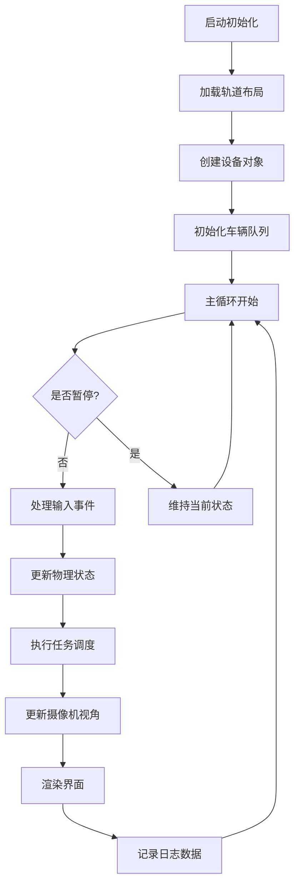
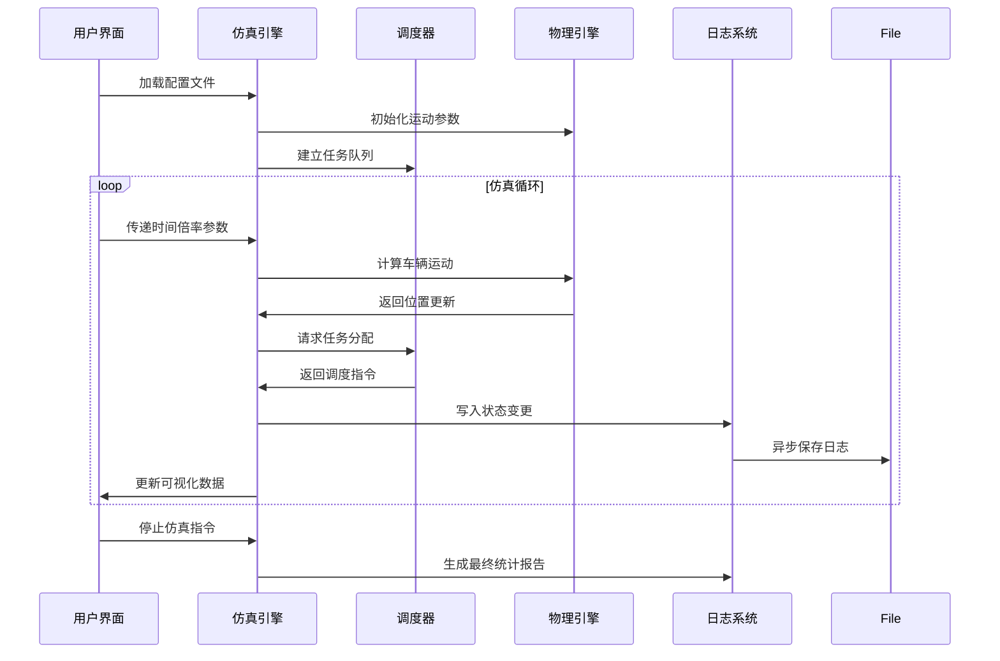

## 图形化界面设计思路
图形化界面中包含工具栏、状态展示框、仿真界面框，仿真界面框中包含整个物流系统的地图，轨道、出入库接口设备、物流车，这些出入库接口设备和物流车是可操作的物理对象，他们分别有属性和状态，物流车包含的属性有：编号、位置、速度、加速度、是否空闲（未运货但是已指派任务为被占用状态）、是否运货；出入库接口设备状态有：编号，是否可被作为任务起始设备，是否出（入）库中、任务等待队列、当前任务等待物流车辆编号；左键仿真界面框后进入仿真界面的操作状态，此时通过鼠标右键按住拖动可以移动2d仿真环境在界面中展示的摄像机的位置，鼠标滚轮操作可以放大或缩小2d仿真环境，鼠标左键单击对象会在仿真界面框左侧的状态展示框中列出对象的状态，鼠标左键点击仿真界面框外以退出仿真界面操作状态。状态展示框在未点击仿真界面对象前，展示的是当前待处理的任务队列，在仿真界面操作状态期间点击了非对象后状态展示框也会回到展示当前待处理的任务队列，如果点击任务队列中的某个任务，可以定位到当前任务的包裹所在的位置（出入库接口设备或物流车上），此时仿真界面的摄像头将跟踪该包裹，在仿真界面操作状态下鼠标右键拖动一下解除跟踪；在出库接口设备对象中的可被当作起始库的对象被点击后，状态展示框中除了展示出入库接口设备的状态外，还有一个手动添加任务的按钮，点击后弹出一个单独的windows框，输入任务的目标接口设备编号，确定后将在该设备的任务末尾添加该任务。工具栏中包含仿真速率设定按钮和仿真暂停按钮，展示累积仿真时间（仿真周期数），也包括任务导入按钮导入特定任务格式的文档以添加任务到队列末尾。

## 项目目标
构建基于SFML的可视化环形轨道物流仿真系统，实现：
1. 动态可视化 - 精确绘制环形轨道布局（含12个出入库接口+6个作业区接口）、穿梭车运动过程（含加减速动画）、设备状态变化（颜色/图标区分空闲/占用状态）
2. 交互操作 - 支持视角平移缩放（右键拖拽+滚轮）、对象状态查询（左键点击）、手动任务添加（通过设备上下文菜单）
3. 任务调度框架 - 提供车辆控制接口（moveTo、load、unload）和任务队列接口（addTask、getPendingTasks），为后续调度算法开发保留扩展点
4. 数据记录系统 - 按规范生成TaskExeLog.txt（精确到毫秒级时间戳）和DeviceStateLog.txt（状态变更事件触发器）
5. 参数化配置 - 通过JSON文件定义轨道尺寸（直轨长度、弯道半径等）、穿梭车参数（加速度曲线、安全距离阈值等）

## 仿真器系统工作流程图


## 核心模块划分
**1. 仿真引擎模块**
- 时间管理：维护虚拟时钟（支持x1/x2/x4倍速）

- 对象容器：管理所有active车辆/设备/任务的智能指针

- 事件分发：处理SFML窗口事件与业务逻辑的映射


**2. 图形界面模块**
- 轨道绘制器：使用SFML顶点数组构建环形轨道（含直轨/弯道不同着色）

- 车辆动画系统：基于运动学方程计算实时位置，生成平滑移动轨迹

- 设备状态指示器：采用图标+颜色编码（绿色=空闲，红色=占用，黄色=准备中）


**3. 任务调度模块**
- 任务队列：优先级队列管理（相同起始设备任务保持FIFO）

- 分配策略接口：定义assignTask纯虚函数供不同算法实现

- 冲突检测器：防止车辆超车/碰撞的预定轨道检查机制


**4. 物理引擎模块**
- 运动控制器：实现梯形速度曲线（含加速段、匀速段、减速段计算）

- 安全距离检查：实时计算车间距（需考虑车辆长度2000mm）

- 装卸计时器：精确控制7.5秒装卸货动画同步


**5. 数据记录模块**
- 日志写入器：异步线程管理文件IO，避免阻塞主循环

- 状态跟踪器：使用观察者模式监控设备状态变更事件

- 统计计算器：实时聚合设备利用率等性能指标


**6. 交互控制模块**
- 视角控制器：实现2D摄像机平移/缩放逻辑

- 对象选取器：基于SFML像素查询的点击检测

- 任务编辑器：弹出式对话框管理自定义任务参数

## C++项目目录及文件结构

```
RingShuttleSim/
├── Core/                             # 核心逻辑模块
│   ├── SimulationEngine.hpp          # 仿真引擎定义
│   ├── SimulationEngine.cpp
│   ├── Vehicle.hpp                   # 车辆对象定义
│   ├── Vehicle.cpp
│   ├── Device.hpp                    # 设备基类定义
│   ├── Device.cpp
|   └── Task.hpp                      # 任务对象定义
├── GUI/                              # 图形界面模块
│   ├── MainWindow.hpp                # 主窗口管理
│   ├── MainWindow.cpp
|   ├── SimulationView.hpp            # 仿真界面绘制
│   ├── SimulationView.cpp
|   ├── TrackRenderer.hpp             # 轨道绘制逻辑
│   ├── TrackRenderer.cpp
│   ├── DeviceRenderer.hpp            # 设备绘制逻辑
│   ├── DeviceRenderer.cpp
│   ├── VehicleRenderer.hpp           # 车辆绘制逻辑
│   ├── VehicleRenderer.cpp
│   ├── TaskList.hpp                  # 任务列表管理
│   ├── TaskList.cpp
│   ├── StatusPanel.hpp               # 状态面板管理
│   ├── StatusPanel.cpp
│   ├── Toolbar.hpp                   # 工具栏管理
│   └── Toolbar.cpp
├── Physics/                          # 物理引擎模块
│   ├── MotionController.hpp          # 运动控制算法
│   ├── MotionController.cpp
│   ├── CollisionDetector.hpp         # 碰撞检测算法
│   ├── CollisionDetector.cpp
│   ├── TrackModel.hpp                # 轨道模型定义
│   └── TrackModel.cpp
├── Data/                             # 数据配置与日志
│   ├── ConfigLoader.hpp              # JSON配置文件解析
│   ├── TaskLogger.hpp                # 任务日志记录器
│   ├── DeviceLogger.hpp              # 设备状态记录器
│   ├── StatisticsAggregator.hpp      # 统计指标计算器
│   └── DataTypes.hpp                 # 数据结构定义
├── ThirdParty/                       # 第三方库封装
│   └── SFMLWrapper.hpp               # SFML功能扩展
├── main.cpp                          # 程序入口
└── Resources/                        # 资源文件
    ├── config.json                   # 系统参数配置
    ├── tasks.csv                     # 初始任务列表
    └── fonts/                        # 字体文件
```

### 类设计部分参考每个独立的todolist

### 开发注意事项

1. SFML初始化规范
- 使用 `sf::RenderWindow` 创建主窗口

- 加载纹理资源时采用 `sf::Texture::loadFromFile` 配合异常处理

- 所有图形元素继承 `sf::Drawable` 实现统一绘制接口


2. 时间管理精度
```cpp
// 时间计算示例
sf::Time realTime = clock.restart();
float scaledDelta = realTime.asSeconds() * timeScale;
stepSimulation(scaledDelta);
```

3. 对象选取算法
```cpp
// 点击检测逻辑伪代码
sf::Vector2f mousePos = window.mapPixelToCoords(
    sf::Mouse::getPosition(window)
);

for (auto& vehicle : vehicles) {
    if (vehicle->getGlobalBounds().contains(mousePos)) {
        selectedObject = vehicle;
        break;
    }
}
```

4. 日志记录优化
- 使用异步写入线程：`std::async` + 线程安全队列

- 二进制缓存机制减少磁盘IO次数


5. 关键性能指标
```cpp
// 设备利用率计算公式
float utilization = (totalTime - idleTime) / totalTime * 100;
```

## 系统运行流程图解


