# 仓库调度系统前端架构流程图

## 📋 文档概述

本文档详细展示了仓库调度系统的前端完整工作逻辑和执行流程，包括主程序入口、GUI系统架构、事件处理机制、渲染流水线等核心组件的交互关系。

---

## 🚀 主程序执行流程 (test/main.cpp)

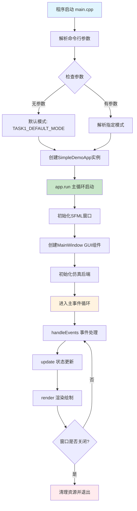

---

## 🎨 前端GUI系统完整架构流程

### 1. 系统初始化流程

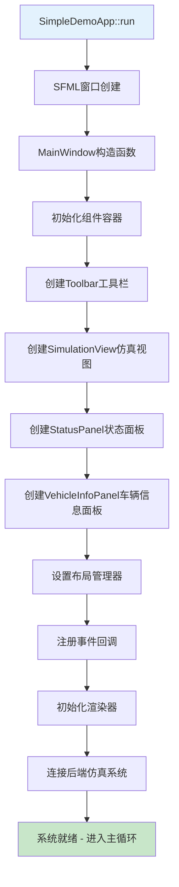

### 2. 主循环三阶段架构

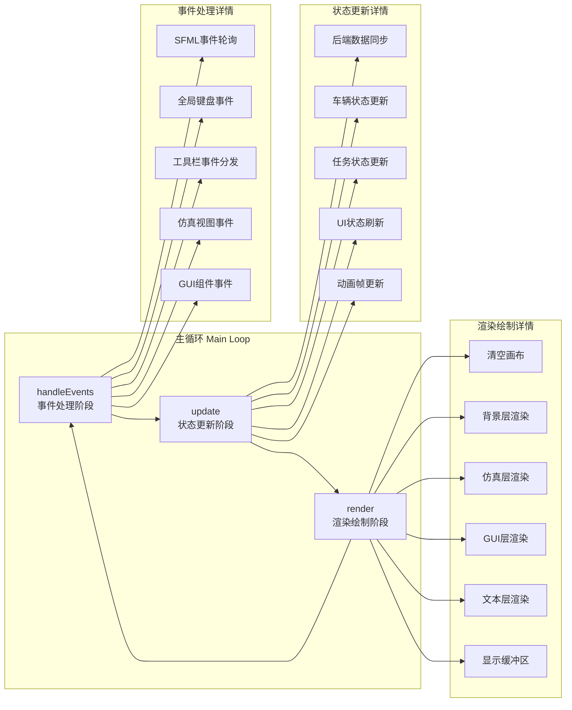

---

## 🎯 事件处理系统详细流程

### 分层事件处理机制

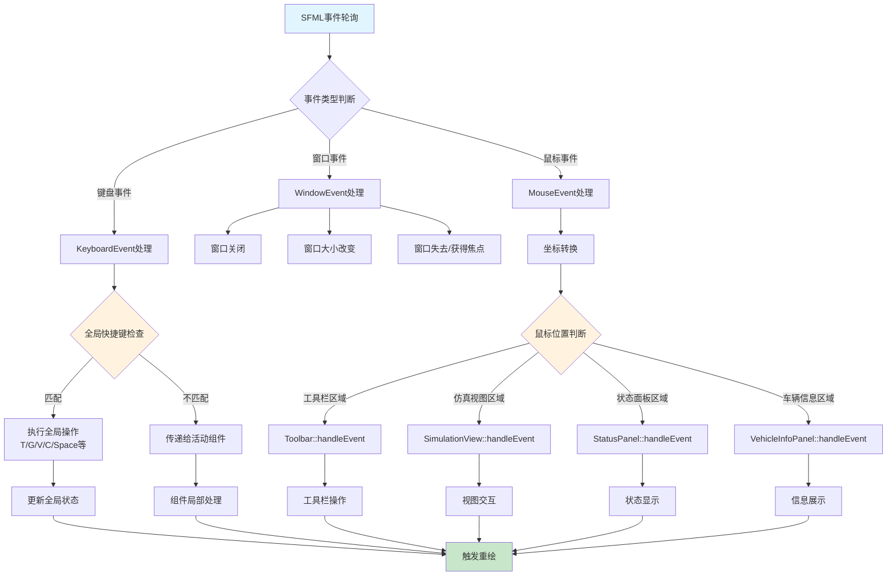

### 键盘事件优先级处理

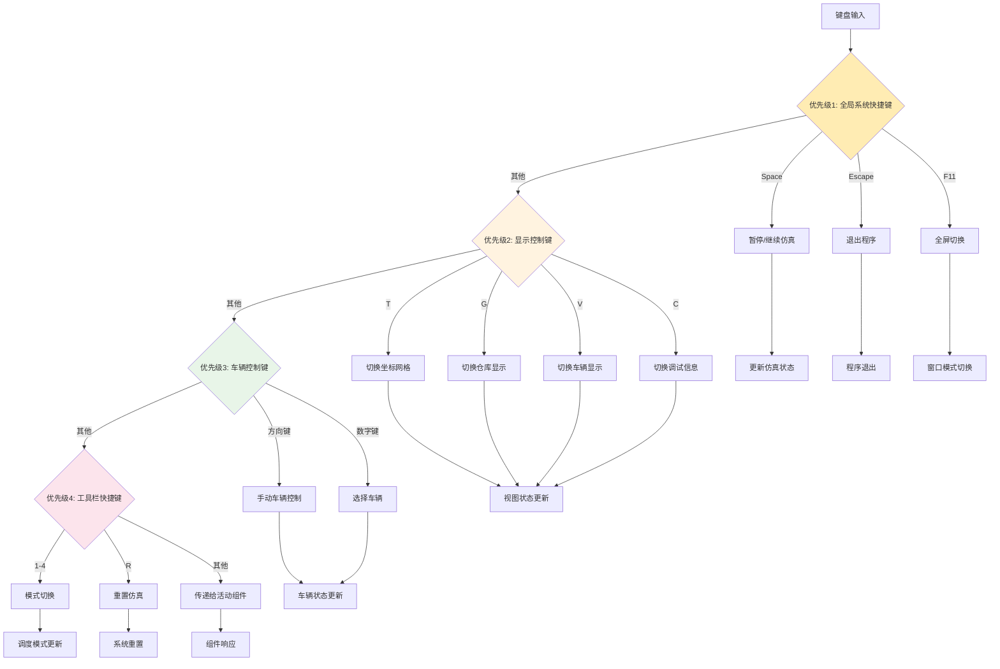

---

## 🎨 渲染系统多层架构

### 渲染流水线详细流程

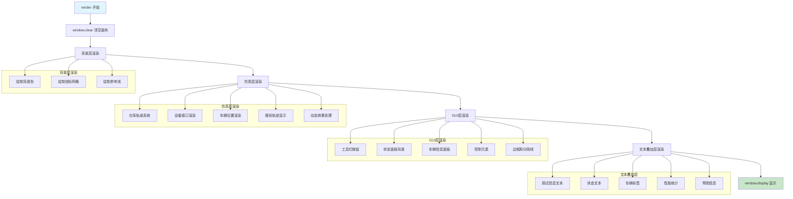

### 组件渲染调用层次

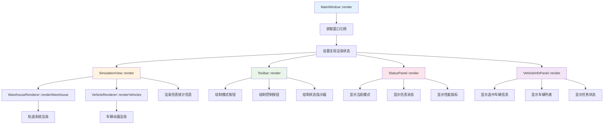

---

## 🔄 数据流和状态同步机制

### 前后端数据同步流程

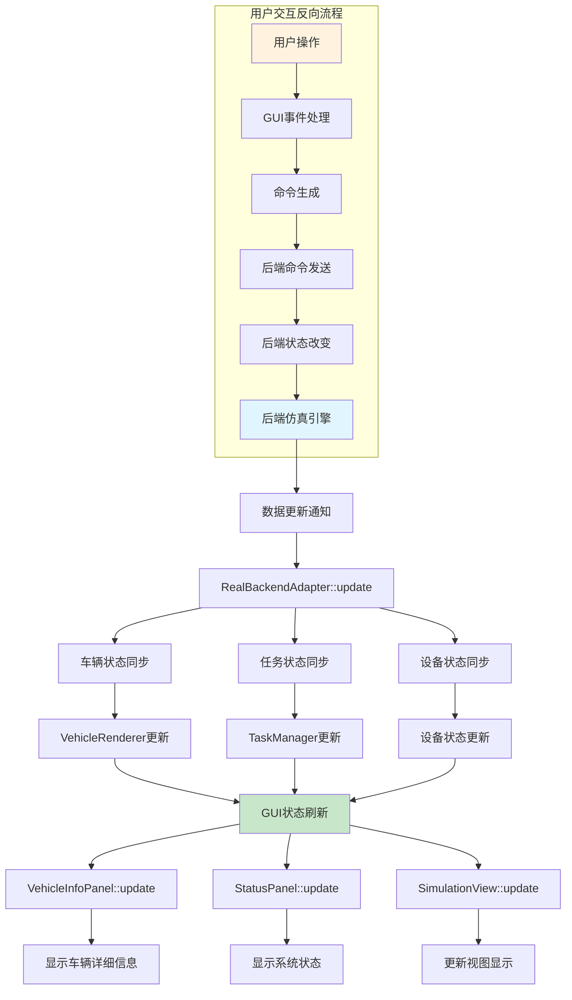

### 状态管理架构

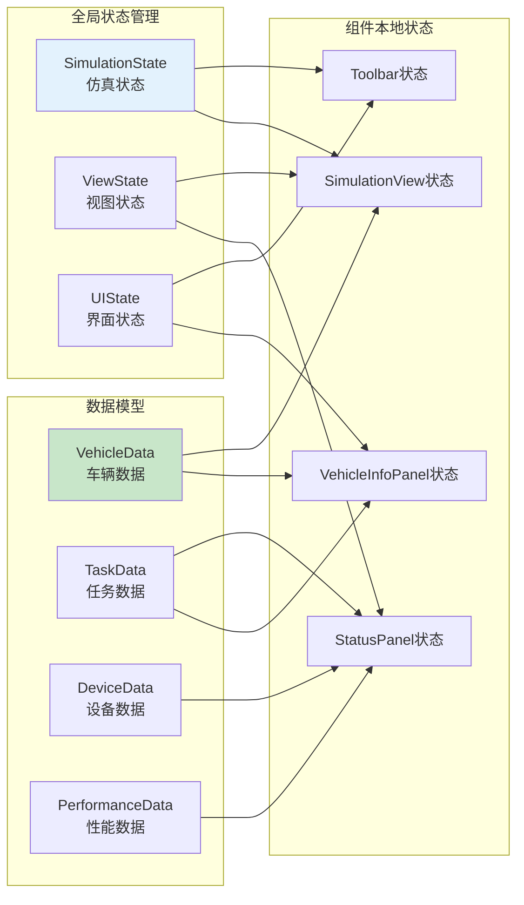

---

## 🏗️ 组件交互关系图

### GUI组件层次结构

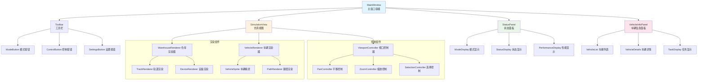

### 组件通信机制

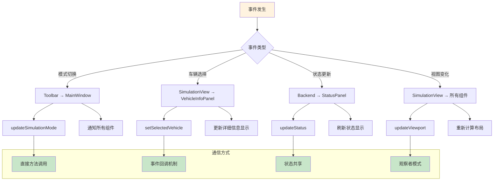

---

## 🔧 性能优化和渲染优化

### 渲染性能优化策略

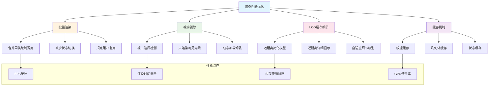

---

## 📊 调试和开发工具集成

### 调试信息显示系统

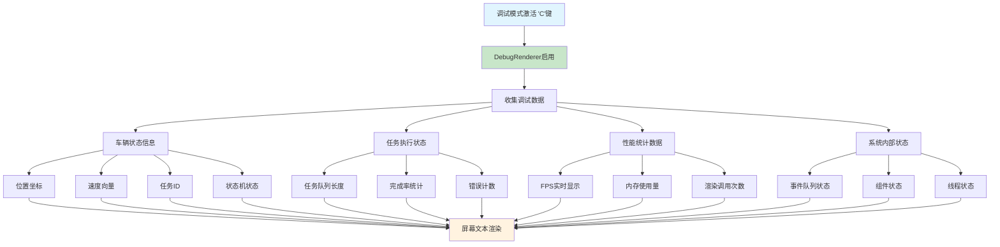

---

## 📈 总体架构总结

### 系统架构层次图

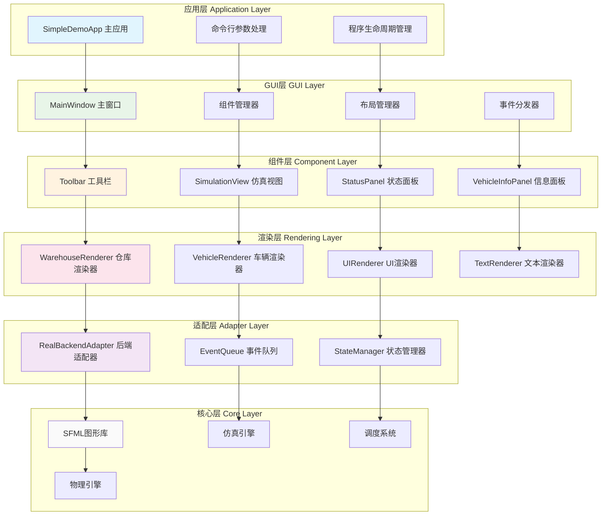

---

## 🎯 关键技术特性

### 1. **模块化设计**
- 清晰的组件边界和职责分离
- 可插拔的渲染器和适配器
- 统一的事件处理接口

### 2. **高性能渲染**
- 多层渲染流水线
- 批量绘制优化
- 视锥剔除和LOD

### 3. **实时交互**
- 分层事件处理系统
- 优先级驱动的输入响应
- 流畅的用户交互体验

### 4. **可扩展架构**
- 适配器模式连接前后端
- 组件化的GUI系统
- 灵活的状态管理机制

---

## 📝 开发和维护说明

### 添加新GUI组件的流程
1. 继承基础组件类
2. 实现handleEvent、update、render方法
3. 在MainWindow中注册和布局
4. 配置事件路由和状态同步

### 性能调优指南
1. 使用性能分析工具监控渲染性能
2. 优化绘制调用批次
3. 实施合适的缓存策略
4. 根据需要调整渲染精度

### 调试技巧
1. 使用'C'键开启调试模式
2. 检查控制台输出的详细日志
3. 监控事件处理链路
4. 分析状态同步时序

---

*文档创建时间: 2025年6月7日*  
*基于项目版本: Warehouse-sch v1.0*  
*架构分析: 前端GUI系统完整流程*
